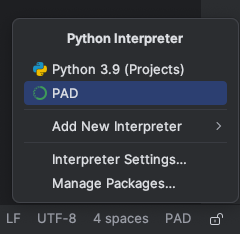
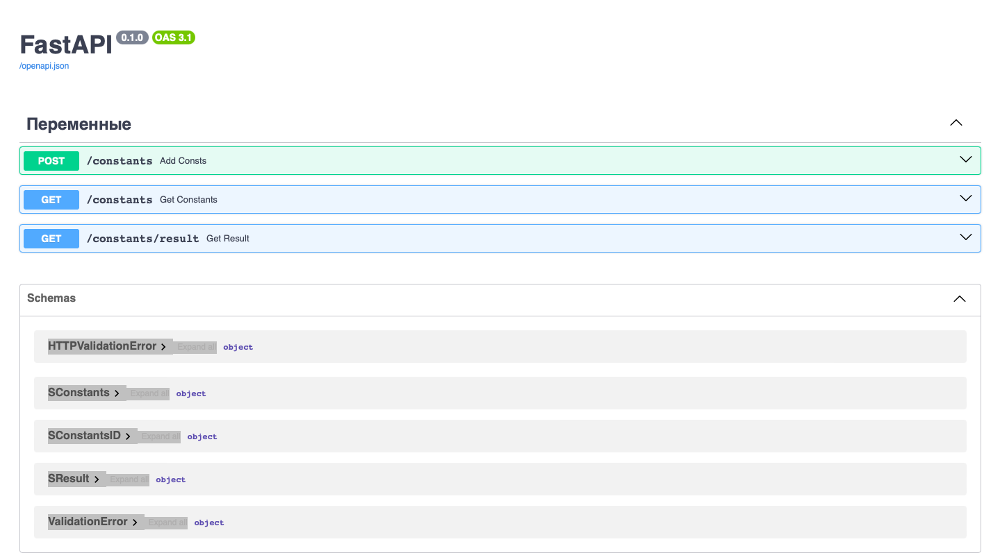

## Установка зависимостей с помощью Conda
Для установки зависимостей понадобится хотя бы **MiniConda**.  
URL: https://docs.anaconda.com/free/miniconda/  
Далее создаем окружение **Conda**: 

```conda create --name <NAME> --file conda-requirements.yml -c conda-forge```  

В качестве виртуального окружения выбрать созданное окружение под выбранным именем.  

## Установка зависимостей с помощью pip
Для установки зависимостей выполнить команду:  
```pip install -r requirements.txt```

## Запуск сервера 
Сервер запускается выполнением следующей команды в директории:  

```uvicorn main:app --reload```  

После чего по адресу http://127.0.0.1:8000/docs будет получен доступ к документации API.


